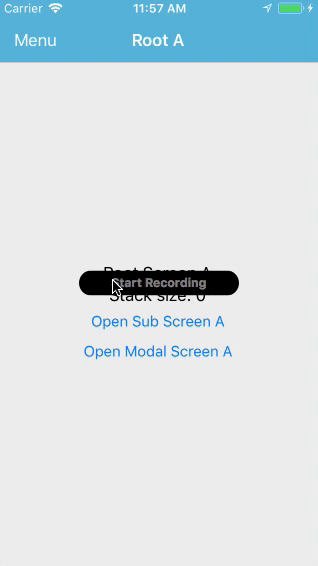
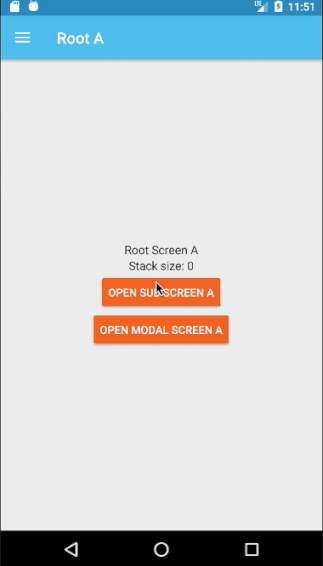

[](http://www.appcelerator.com/titanium/)
[](http://www.appcelerator.com/alloy/)
[](http://choosealicense.com/licenses/apache-2.0/)

# Axway Appcelerator Titanium Alloy Drawer Navigation Boilerplate

Originally we started this based on [HazemKhaled's](https://github.com/HazemKhaled) sample application [SideMenu-with-NavigationWindow-for-Titanium](https://github.com/HazemKhaled/SideMenu-with-NavigationWindow-for-Titanium).

After playing with it we decided to come up with a simple boilerplate so we could have a working base for both iOS and Android to start developing applications using a drawer menu base navigation.

iOS Demo           |  Android Demo
:-----------------:|:-------------------------:
  |  

## Dependancies (all included)

* [Napp Drawer native Module](http://gitt.io/component/dk.napp.drawer) native module for iOS Drawer menu
* [Ti.DrawerLayout](http://gitt.io/component/com.tripvi.drawerlayout) native module for Android Drawer menu
* [nl.fokkezb.drawer](http://gitt.io/component/nl.fokkezb.drawer) Alloy Widget to integrate both native menus
* [ti-window-stack](app/lib/ti-window-stack.js) to manage a stack of opened Windows (modified version of [TiWindowStack](http://gitt.io/component/ti-window-stack))
* [xp.ui](app/lib/xp.ui.js) Cross-Platform UI CommonJS library to manage cross compatibilities between iOS and Android (especially around `Ti.UI.iOS.NavigationWindow` and `Ti.UI.Window` elements)

## Requirements

* Ti SDK 6.3.0.GA+
* All dependancies.

## Usage and explanations

### nl.fokkezb.drawer

Forked form [TiWindowStack](https://github.com/fokkezb/nl.fokkezb.drawer) version 1.1.3.

**Note:** version 1.2.0 supports official `Ti.UI.Android.DrawerLayout` but this breaks some functionalities for us, so we'll stick with version 1.1.3.

This is used in order to abstract the functionalities for each native module used so our Alloy application just have to call one function for both.

### ti-window-stack

Inspired by Fokke's [xp.ui](https://github.com/FokkeZB/UTiL/blob/master/app/lib/xp.ui.js).

We had to modify it in order to add some extra functionalities like `home()`, `back()`, `getSize()`, `isRootLevel()`.

This provides very useful functions in order to maintain a stack of windows in memory.

On iOS it's creating and maintaining a `Ti.UI.iOS.NavigationWindow` element automatically.

On Android it simply opens `Ti.UI.Window` elements.

### xp.ui

Forked and modified form [TiWindowStack](https://github.com/HazemKhaled/TiWindowStack).

This is making both `<NavigationWindow>` and `<Window>` elements cross compatible for iOS and Android.

#### Organisation

We declare our stack of Windows from `app/alloy.js` and store it within `Alloy.Globals` so we can reuse it.

The initial structure of the main interface is defined within the main entry point of the app `app/controllers/index.js` and `app/views/index.js`.

```xml
<Alloy>
    <Widget id="drawer" src="nl.fokkezb.drawer">
        <View platform="android" role="leftWindow" />
        <View platform="android" role="centerWindow" />
    </Widget>
</Alloy>
```

`<View platform="android" role="rightWindow" />` can be added conditionally.

`$.drawer.setLeftWindow();` and `$.drawer.setRightWindow();` can be called too.

You don't need to declare a `<NavigationWindow>` element as `ti-window-stack` will handle it for you.
You can still declare another one if you want to create a modal window with a NavBar on iOS for example (sample included `app/views/modalA.xml`).

#### "role" attribute

`xp.ui` and `nl.fokkezb.drawer` will need a Window (or View on Android) for each section of the main interface (rendering the drawer menu).

* Center Window/View
* Left and/or Right Window/View

You define those from the `index` entry point and also by specifying the `role` of each `<Window>`. See `app/views/rootA.xml`.

This especially required for Android so we know we need to build a `Ti.UI.View` rather than a `Ti.UI.Window` for those.

The `role` attribute on a `<Window module="xp.ui">` can either be `main` or `menu`.

#### Openning new Windows

Every time you call `Alloy.Globals.windowStack.open()` you can conditionally pass the instance of the "drawer" as a second parameter.
If you do pass it, `ti-window-stack` will try to open the new window as one of the "root" of you navigation.
If you don't pass it, it will open it as a "child" window within your navigation flow.

`ti-window-stack` will update the stack in memory accordingly and `ti-window-stack:sizechanged` event will be triggered on the `Ti.UI.Window` you're openning.

This is used from `xp.ui` in order to enable the swipping gesture and the toggle the main menu icon from the NavBar on iOS.

#### Controls

**iOS Main menu button (hamburger)**

It needs to be included in the root views:

```xml
<Alloy>
    <Window module="xp.ui" role="main">
        <LeftNavButton platform="ios">
            <Require src="_menuButton" />
        </LeftNavButton>
        ...
    </Window>
</Alloy>
```

**Android main menu button**

Already included by `com.tripvi.drawerlayout`.

**iOS swipping gestures**

On iOS, we need to disable the swipping gesture for the drawer menu on children windows.
This is automatically done by `xp.ui`.

On iOS you can back to the previous window by swipping back.
This is still possible for children windows opened within the root window of the drawer.
This is supported as expected.

**Android home button**

On chidlren windows, the home button (in the ActionBar) should be available, rendering the left pointing arrow in order to close the current window.

This is automatically handled by `xp.ui` too.

### Play by the rules

`module="xp.ui"` needs to be specified on every `<Window>` element which is going to require automatic built-in functionalities like described here.

It can also be used on a `<NavigationWindow>` element if you need to add a modal window for example. It will be cross-compatible with Android.

Use the following functions to navigate through the stack if windows:

* `Alloy.Globals.windowStack.open()`
* `Alloy.Globals.windowStack.back()`
* `Alloy.Globals.windowStack.home()`

and optionally

* `Alloy.Globals.windowStack.close()`
* `Alloy.Globals.windowStack.close()`

## License

```
Copyright 2017 Cyber-Duck Ltd

Licensed under the Apache License, Version 2.0 (the "License");
you may not use this file except in compliance with the License.
You may obtain a copy of the License at

   http://www.apache.org/licenses/LICENSE-2.0

Unless required by applicable law or agreed to in writing, software
distributed under the License is distributed on an "AS IS" BASIS,
WITHOUT WARRANTIES OR CONDITIONS OF ANY KIND, either express or implied.
See the License for the specific language governing permissions and
limitations under the License.
```
